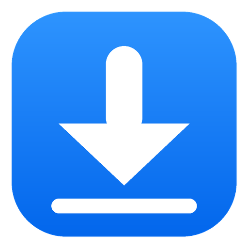

<p align="center"></p>

# omnidl

Ein Desktop-Downloader für Windows, geschrieben in Rust. Link einfügen, Format wählen,
fertig — YouTube, TikTok, Spotify, Instagram, SoundCloud und die rund 1800 weiteren
Seiten, die yt-dlp kennt.


[](https://github.com/Hattinga/omnidl/actions/workflows/ci.yml)

## Installieren

**Installer:** `omnidl-<version>-x64.msi` unter [Releases](https://github.com/Hattinga/omnidl/releases/latest)
laden und doppelklicken. Braucht keine Administratorrechte, landet in
`%LOCALAPPDATA%\Programs\omnidl` und im Startmenü.

**Ohne Installation:** `omnidl.exe` aus demselben Release in einen beliebigen Ordner legen
und starten. Einstellungen und Werkzeuge liegen dann daneben.

Beim ersten Start lädt die App ihre Werkzeuge selbst nach `bin/` (yt-dlp, ffmpeg, Deno,
gallery-dl, zusammen ~500 MB). Das dauert einmalig ein bis zwei Minuten; eingefügte Links
warten so lange.

## Was geht

| Quelle | Ergebnis |
|---|---|
| YouTube (Video, Shorts, Playlist, Kanal) | Video oder Audio im gewählten Format |
| TikTok | Video; Foto-Slideshows landen als Bilderordner |
| Spotify (Track, Album, Playlist, Künstler) | Titelliste von Spotify, Audio von YouTube Music, getaggt mit Cover |
| Instagram, X, Reddit, Twitch, SoundCloud, Vimeo, Bandcamp … | was yt-dlp hergibt, sonst gallery-dl |

Playlists werden in Einzeljobs aufgefächert und laufen parallel (einstellbar 1–16).
Mehrere Links auf einmal einfügen geht auch. Die Oberfläche folgt dem hellen oder dunklen
Modus von Windows.

### Nichts geht verloren

Was beim Schließen noch lädt oder wartet, steht in `queue.json` und läuft beim nächsten
Start weiter — auch nach einem Absturz oder einem Update. Bei Playlists und Alben werden
Titel, die schon fertig sind, übersprungen. Gestoppte oder fehlgeschlagene Downloads lassen
sich mit ↻ erneut versuchen.

### Später laden

Das Uhr-Symbol neben „Laden“ plant die eingefügten Links: in 30 Minuten, in einer Stunde,
heute Nacht um 2:00 oder zu einer eigenen Uhrzeit. ▶ startet einen geplanten Download
sofort. Die App muss zur Startzeit laufen; war sie aus, beginnt der Download beim nächsten
Start.

### Aus dem Browser

Die Erweiterung für Chrome, Edge und Firefox schickt die offene Seite oder einen Link an
omnidl — über das Symbol in der Leiste, `Alt+Umschalt+D` oder per Rechtsklick
(„Link als Audio laden“ …). Läuft omnidl gerade nicht, startet der Browser es.

Einrichten: in omnidl **Einstellungen → Browser → Ordner öffnen …**, dann

- **Chrome / Edge / Brave:** `chrome://extensions` (bzw. `edge://extensions`) öffnen,
  *Entwicklermodus* einschalten, *Entpackte Erweiterung laden* und den Ordner wählen.
- **Firefox:** `about:debugging#/runtime/this-firefox` → *Temporäres Add-on laden* →
  `manifest.json` im Ordner. (Firefox vergisst temporäre Add-ons beim Beenden.)

Die Erweiterung spricht nur mit `127.0.0.1:47813`. omnidl nimmt dort ausschließlich Links
an und nur von Erweiterungen oder omnidl selbst — Webseiten werden abgewiesen.

### Updates

omnidl schaut zweimal täglich unter [Releases](https://github.com/Hattinga/omnidl/releases)
nach einer neuen Version und meldet sie oben im Fenster. „Aktualisieren“ lädt sie, prüft die
SHA-256-Prüfsumme und tauscht die exe aus; nach „Neu starten“ laufen offene Downloads weiter.
Abschaltbar in den Einstellungen unter *App*.

Ein zweiter Start von omnidl öffnet keine zweite Instanz, sondern reicht seine Links an die
laufende weiter.

## Grenzen — ehrlich

- **Spotify liefert keine Audiodaten.** Der Stream ist DRM-geschützt. Die App liest nur die
  öffentliche Titelliste und sucht denselben Song auf YouTube Music. Das trifft fast immer,
  aber nicht immer: Passt die Länge nicht, wird der nächste Kandidat probiert, sonst steht
  „kein passender Treffer“.
- **Spotify-Playlists: maximal 100 Titel.** Die öffentliche Embed-Seite gibt nicht mehr her.
- **Audioqualität ist von der Quelle begrenzt** (~128–160 kbps). MP3 320, WAV und FLAC machen
  die Datei größer, nicht besser.
- **Netflix, Disney+, Prime, Spotify-Originalstream: nein.** DRM, und das bleibt so.
- **YouTube ändert regelmäßig etwas.** Wenn Downloads plötzlich scheitern: in den
  Einstellungen (`Strg+,`) bei yt-dlp „Aktualisieren“ drücken, das holt die neuste Version.
  Deshalb braucht YouTube seit Ende 2025 auch eine JavaScript-Laufzeit (Deno), die die App
  mitbringt.
- Für private Inhalte, Altersbeschränkungen oder „nur für Abonnenten“: in den Einstellungen
  Cookies auf deinen Browser stellen (Firefox funktioniert unter Windows am zuverlässigsten,
  Chrome verschlüsselt seine Cookies inzwischen so, dass es oft scheitert).

Gedacht für Inhalte, die du selbst laden darfst — eigene Uploads, freie Inhalte,
Privatkopien. Was du damit tust, liegt bei dir.

## Dateien

Alles liegt neben der `omnidl.exe`:

| | |
|---|---|
| `config.toml` | Einstellungen (Zahnrad oben rechts oder `Strg+,`), bei jeder Änderung gespeichert |
| `queue.json` | offene und geplante Downloads |
| `bin/` | yt-dlp, ffmpeg, Deno, gallery-dl |
| `browser-extension/` | die Erweiterung, sobald sie einmal ausgepackt wurde |

Das Deinstallieren über *Apps & Features* entfernt all das mit. Die geladenen Dateien im
Download-Ordner bleiben.

## Entwicklung

```
cargo test                      # 78 Unit-Tests, kein Netzwerk
cargo test -- --ignored         # 4 End-to-End-Tests, echte Downloads
cargo build --release           # target/release/omnidl.exe
```

Aufbau: `app.rs` zeichnet die Oberfläche (egui), `theme.rs` und `widgets.rs` liefern Farben,
Schrift und Bedienelemente im Apple-Stil, `engine.rs` verteilt Jobs auf einen Worker-Pool
(tokio), `journal.rs` hält die Warteschlange auf der Platte, `schedule.rs` rechnet
Startzeiten, `ytdlp.rs` steuert yt-dlp und liest dessen Fortschritt, `spotify.rs` liest die
Embed-Seite, `matcher.rs` bewertet Suchtreffer nach Titel, Künstler und Länge, `tagger.rs`
schreibt die Metadaten, `deps.rs` hält die Werkzeuge aktuell, `bridge.rs` ist die Tür für
die Browser-Erweiterung und für zweite Starts, `launch.rs` liest Startargumente und
`omnidl://`-Links, `update.rs` aktualisiert die App, `sys.rs` kapselt Windows-Eigenheiten.
Die Erweiterung liegt in `extension/`, der Installer in `installer/`.

### Release

1. Version in `Cargo.toml` und `extension/manifest.json` erhöhen (ein Test prüft, dass beide
   gleich sind), Abschnitt in `CHANGELOG.md` ergänzen.
2. `git tag v0.3.0 && git push origin v0.3.0` — GitHub Actions baut exe, MSI und Prüfsummen
   und veröffentlicht das Release. Laufende Installationen bieten das Update von selbst an.
3. Optional für winget: `powershell -File packaging/winget.ps1 -Version 0.3.0` schreibt die
   Manifeste nach `packaging/winget/0.3.0/`, einzureichen bei
   [microsoft/winget-pkgs](https://github.com/microsoft/winget-pkgs).

Lokal baut `powershell -File packaging/release.ps1` dasselbe nach `dist/`
(braucht WiX 5: `dotnet tool install --global wix --version 5.0.2`).
`python packaging/make_icons.py` erzeugt die Symbole neu.

## Lizenz

MIT, siehe [LICENSE](LICENSE). yt-dlp, ffmpeg, Deno und gallery-dl sind nicht enthalten;
die App lädt sie beim ersten Start von ihren offiziellen Quellen.
