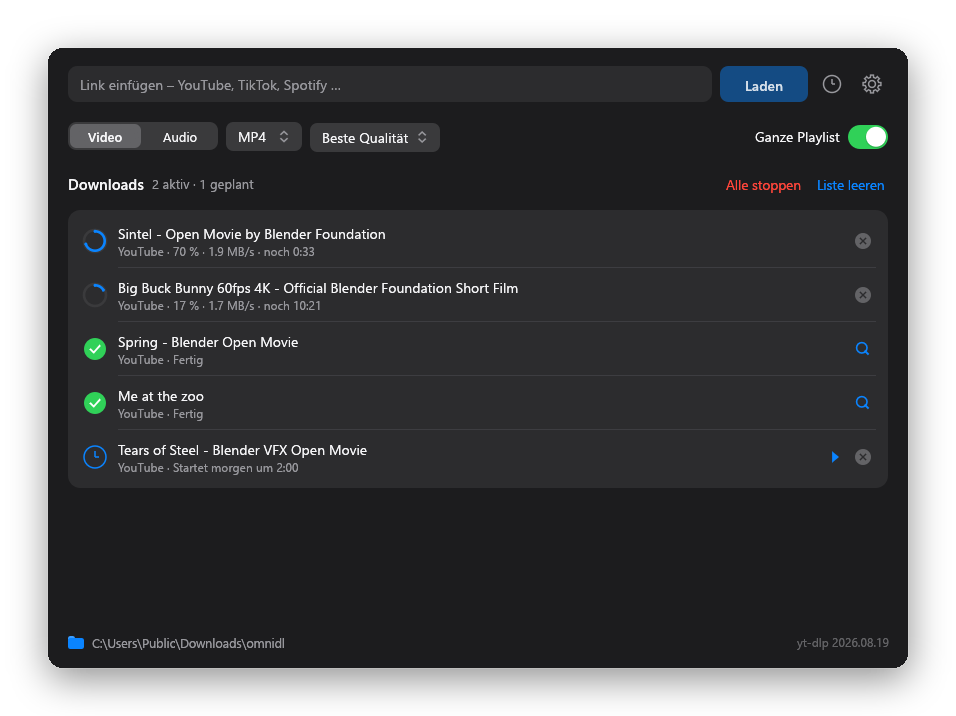
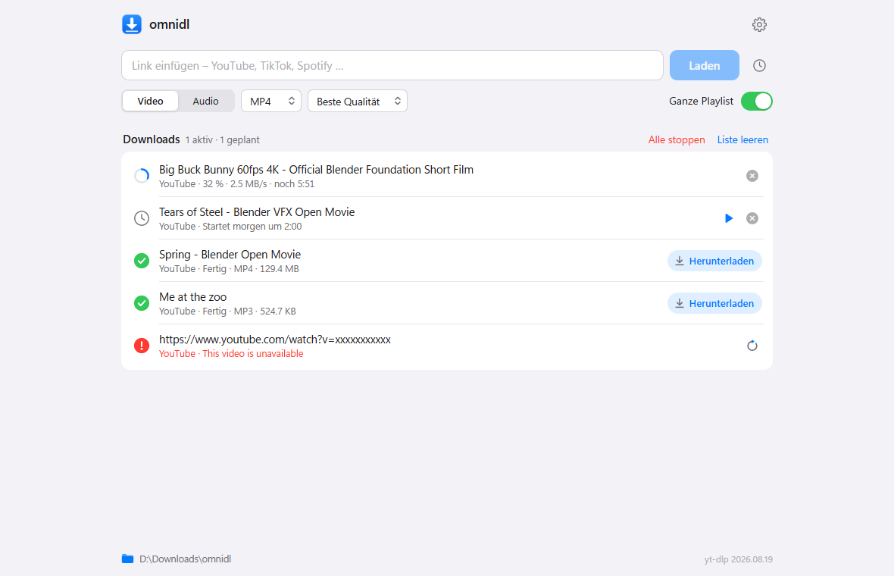
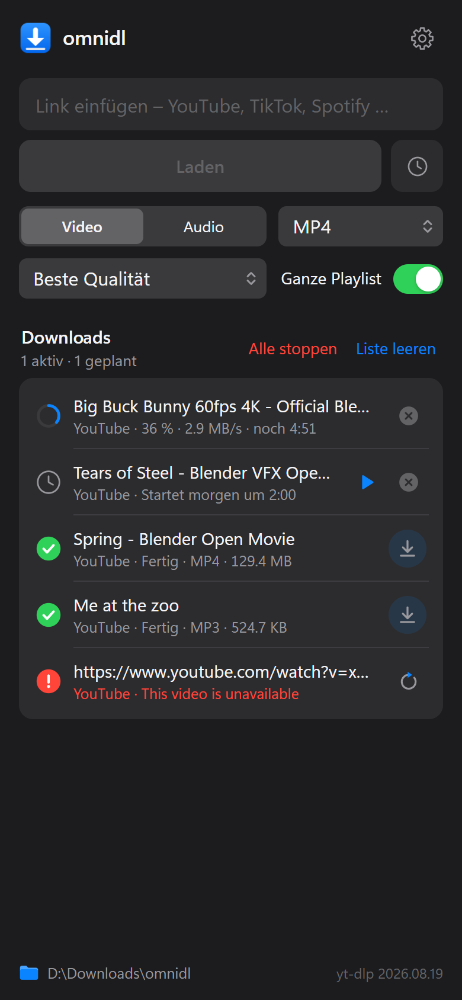

<p align="center"></p>

# omnidl

Link einfügen, Format wählen, fertig: ein Downloader für YouTube, TikTok, Spotify,
Instagram, SoundCloud und die rund 1800 weiteren Seiten, die yt-dlp kennt. Als App für
Windows, macOS und Linux, im Terminal oder als Web-Interface auf dem Server, NAS oder
Raspberry Pi.

[](https://github.com/Hattinga/hattis-projekte/releases/latest)

[](https://github.com/Hattinga/hattis-projekte/actions/workflows/omnidl-ci.yml)

<p align="center"></p>

## Download

Alle Dateien liegen unter **[Releases → neueste Version](https://github.com/Hattinga/hattis-projekte/releases/latest)**.

| System | Datei | |
|---|---|---|
| **Windows 10/11** | `omnidl-…-x64.msi` | Installer, ohne Administratorrechte |
| | `omnidl.exe` | ohne Installation, läuft aus jedem Ordner |
| **macOS 11+** (Apple Silicon und Intel) | `omnidl-…-macos.dmg` | öffnen, omnidl in „Programme“ ziehen |
| **Ubuntu, Debian, Mint** | `omnidl_…_amd64.deb` (ARM: `_arm64.deb`) | `sudo apt install ./omnidl_…_amd64.deb` |
| **Andere Linux** | Skript, ohne root | siehe unten |
| **Server, NAS, Docker** | `omnidl-cli` | siehe [Web-Interface](#web-interface-für-server-und-nas) |

Linux ohne `.deb` (installiert nach `~/.local/bin`, mit Menüeintrag):

```sh
curl -fsSL https://github.com/Hattinga/hattis-projekte/releases/latest/download/install.sh | sh -s -- --desktop
```

Alle Wege im Detail, auch Windows Server und Server Core: [packaging/INSTALL.md](packaging/INSTALL.md).

### Beim ersten Start

omnidl ist nicht von Microsoft oder Apple signiert. Deshalb fragt das System beim ersten
Öffnen einmal nach:

- **Windows** zeigt „Der Computer wurde durch Windows geschützt“: auf **Weitere
  Informationen** klicken, dann **Trotzdem ausführen**.
- **macOS** meldet, dass es omnidl nicht prüfen kann: **Systemeinstellungen → Datenschutz &
  Sicherheit → Dennoch öffnen**. Oder einmal im Terminal:
  `xattr -dr com.apple.quarantine /Applications/omnidl.app`

Danach lädt die App ihre Werkzeuge selbst (yt-dlp, ffmpeg, Deno, gallery-dl, zusammen
~500 MB). Das dauert einmalig ein bis zwei Minuten; eingefügte Links warten so lange. Unter
macOS und Linux nutzt omnidl ein schon installiertes ffmpeg oder yt-dlp (Homebrew, apt) mit.

Jede Datei im Release hat eine `.sha256`-Prüfsumme daneben.

## Was geht

| Quelle | Ergebnis |
|---|---|
| YouTube (Video, Shorts, Playlist, Kanal) | Video oder Audio im gewählten Format |
| TikTok | Video; Foto-Slideshows landen als Bilderordner |
| Spotify (Track, Album, Playlist, Künstler) | Titelliste von Spotify, Audio von YouTube Music, getaggt mit Cover |
| Instagram, X, Reddit, Twitch, SoundCloud, Vimeo, Bandcamp … | was yt-dlp hergibt, sonst gallery-dl |

Playlists werden in Einzeljobs aufgefächert und laufen parallel (einstellbar 1–16).
Mehrere Links auf einmal einfügen geht auch. Die Oberfläche folgt dem hellen oder dunklen
Modus des Systems.

### Nichts geht verloren

Was beim Schließen noch lädt oder wartet, läuft beim nächsten Start weiter, auch nach einem
Absturz oder einem Update. Bei Playlists und Alben werden Titel, die schon fertig sind,
übersprungen. Gestoppte oder fehlgeschlagene Downloads lassen sich mit ↻ erneut versuchen.

### Später laden

Das Uhr-Symbol neben „Laden“ plant die eingefügten Links: in 30 Minuten, in einer Stunde,
heute Nacht um 2:00 oder zu einer eigenen Uhrzeit. ▶ startet einen geplanten Download
sofort. Die App muss zur Startzeit laufen; war sie aus, beginnt der Download beim nächsten
Start.

### Aus dem Browser

Die Erweiterung für Chrome, Edge, Brave und Firefox schickt die offene Seite oder einen
Link an omnidl: über das Symbol in der Leiste, `Alt+Umschalt+D` oder per Rechtsklick
(„Link als Audio laden“ …). Läuft omnidl gerade nicht, startet der Browser es.

Einrichten: in omnidl **Einstellungen → Browser → Ordner öffnen …**, dann

- **Chrome / Edge / Brave:** `chrome://extensions` (bzw. `edge://extensions`) öffnen,
  *Entwicklermodus* einschalten, *Entpackte Erweiterung laden* und den Ordner wählen.
- **Firefox:** `about:debugging#/runtime/this-firefox` → *Temporäres Add-on laden* →
  `manifest.json` im Ordner. (Firefox vergisst temporäre Add-ons beim Beenden.)

Die Erweiterung spricht nur mit `127.0.0.1:47813`. omnidl nimmt dort ausschließlich Links
an und nur von Erweiterungen oder omnidl selbst; Webseiten werden abgewiesen.

### Updates

omnidl schaut zweimal täglich unter [Releases](https://github.com/Hattinga/hattis-projekte/releases)
nach einer neuen Version und meldet sie oben im Fenster. „Aktualisieren“ lädt die Datei
fürs eigene System, prüft die SHA-256-Prüfsumme und tauscht sie aus; nach „Neu starten“
laufen offene Downloads weiter. Abschaltbar in den Einstellungen unter *App*. Wer omnidl
per `.deb` installiert hat, bekommt Updates über die nächste `.deb`-Datei.

Ein zweiter Start von omnidl öffnet keine zweite Instanz, sondern reicht seine Links an die
laufende weiter.

## Im Terminal

`omnidl-cli` kann dasselbe ohne Fenster. Unter Windows legt der Installer es in den PATH,
unter Linux kommt es mit `install.sh` oder dem Paket `omnidl-cli_…deb`, für macOS liegt
`omnidl-cli-macos-universal` im Release.

```sh
omnidl-cli get https://youtu.be/…                  # Video in den Einstellungen der App
omnidl-cli get -f mp3 <Link> <Link>               # als MP3, mehrere Links
omnidl-cli get --at 02:00 -o ~/Videos <Playlist>  # erst um 2:00, in einen anderen Ordner
omnidl-cli get --json <Link>                      # ein JSON-Ereignis pro Zeile, für Skripte
omnidl-cli tools update                           # neuestes yt-dlp holen
```

`omnidl-cli get --help` zeigt alle Optionen (Format, Auflösung, Bitrate, Cookies, parallele
Downloads …).

## Web-Interface für Server und NAS

<p align="center">
  
  
</p>

`omnidl-cli serve` bringt omnidl in den Browser, auch aufs Handy: Links einfügen,
Fortschritt live sehen, später laden, fertige Dateien herunterladen. Ohne weitere Angaben
nur von diesem Rechner aus (`http://127.0.0.1:8080`); `--listen 0.0.0.0:8080` öffnet es fürs
ganze Netz und verlangt dann immer ein Passwort (`--password` oder `OMNIDL_PASSWORD`; ohne
erzeugt omnidl eines und zeigt es beim Start).

**Ubuntu Server, Debian** – als Dienst mit eigenem Benutzer, Daten in `/var/lib/omnidl`:

```sh
sudo apt install ./omnidl-cli_…_amd64.deb     # ARM: _arm64.deb
sudo systemctl enable --now omnidl-web         # → http://<server>:8080
journalctl -u omnidl-web                       # zeigt das erzeugte Passwort
```

**Docker** (amd64 und arm64, z. B. Raspberry Pi 4/5 oder ein NAS):

```sh
docker run -d --name omnidl -p 8080:8080 -e OMNIDL_PASSWORD=geheim \
  -v omnidl-data:/data -v "$PWD/downloads:/downloads" ghcr.io/hattinga/omnidl:latest
```

oder mit [`docker-compose.yml`](docker-compose.yml): `docker compose up -d`.

**Windows Server** – `omnidl-cli-…-windows-x86_64.zip` entpacken und
`omnidl-cli.exe serve --listen 0.0.0.0:8080 --password geheim` starten.

Hinter einem Reverse Proxy (nginx, Caddy, Traefik) läuft das Interface auch unter einem
Unterpfad wie `/omnidl/`; mit HTTPS davor `--secure-cookie` setzen. Einstellungen, Adresse
und Zielordner: [packaging/INSTALL.md](packaging/INSTALL.md).

## Grenzen – ehrlich

- **Spotify liefert keine Audiodaten.** Der Stream ist DRM-geschützt. Die App liest nur die
  öffentliche Titelliste und sucht denselben Song auf YouTube Music. Das trifft fast immer,
  aber nicht immer: Passt die Länge nicht, wird der nächste Kandidat probiert, sonst steht
  „kein passender Treffer“.
- **Spotify-Playlists: maximal 100 Titel.** Die öffentliche Embed-Seite gibt nicht mehr her.
- **Audioqualität ist von der Quelle begrenzt** (~128–160 kbps). MP3 320, WAV und FLAC machen
  die Datei größer, nicht besser.
- **Netflix, Disney+, Prime, Spotify-Originalstream: nein.** DRM, und das bleibt so.
- **YouTube ändert regelmäßig etwas.** Wenn Downloads plötzlich scheitern: in den
  Einstellungen (`Strg+,`) bei yt-dlp „Aktualisieren“ drücken bzw. `omnidl-cli tools update`,
  das holt die neuste Version. Deshalb braucht YouTube seit Ende 2025 auch eine
  JavaScript-Laufzeit (Deno), die die App mitbringt.
- Für private Inhalte, Altersbeschränkungen oder „nur für Abonnenten“: in den Einstellungen
  Cookies auf deinen Browser stellen (Firefox funktioniert unter Windows am
  zuverlässigsten, Chrome verschlüsselt seine Cookies inzwischen so, dass es oft scheitert;
  Safari wird nicht unterstützt).

Gedacht für Inhalte, die du selbst laden darfst: eigene Uploads, freie Inhalte,
Privatkopien. Was du damit tust, liegt bei dir.

## Dateien

| System | Ordner |
|---|---|
| Windows | neben `omnidl.exe` (Installer: `%LOCALAPPDATA%\Programs\omnidl`) |
| macOS | `~/Library/Application Support/omnidl` |
| Linux | `~/.local/share/omnidl` (bzw. `$XDG_DATA_HOME/omnidl`) |
| Dienst / Docker | `/var/lib/omnidl` bzw. `/data` |

Die Umgebungsvariable `OMNIDL_HOME` legt den Ordner überall selbst fest. Darin:

| | |
|---|---|
| `config.toml` | Einstellungen (Zahnrad oben rechts oder `Strg+,`), bei jeder Änderung gespeichert |
| `queue.json` | offene und geplante Downloads (`queue-web.json` fürs Web-Interface) |
| `web.toml` | erzeugtes Passwort des Web-Interfaces |
| `bin/` | yt-dlp, ffmpeg, Deno, gallery-dl |
| `browser-extension/` | die Erweiterung, sobald sie einmal ausgepackt wurde |

Unter Windows entfernt das Deinstallieren über *Apps & Features* all das mit; auf dem Mac
und unter Linux reicht es, den Ordner zu löschen. Die geladenen Dateien im Download-Ordner
bleiben.

## Entwicklung

```
cargo test                      # Unit-Tests, kein Netzwerk
cargo test -- --ignored         # End-to-End-Tests, echte Downloads
cargo build --release           # target/release/omnidl und omnidl-cli
cargo build --release --no-default-features --features cli --bin omnidl-cli
                                # nur Terminal und Server, ohne Grafik-Bibliotheken
```

Linux braucht zum Bauen keine Systembibliotheken (TLS über rustls; X11, Wayland und OpenGL
werden zur Laufzeit geladen).

Aufbau: Die Bibliothek `src/lib.rs` ist alles außer dem Fenster. `engine.rs` verteilt Jobs
auf einen Worker-Pool (tokio) und meldet Ereignisse an einen `Sink`, `jobs.rs` macht daraus
die Liste, die Fenster, Terminal und Browser gleich anzeigen, `journal.rs` hält die
Warteschlange auf der Platte, `schedule.rs` rechnet Startzeiten, `ytdlp.rs` steuert yt-dlp
und liest dessen Fortschritt, `peek.rs` holt Titel vorab über oEmbed, `spotify.rs` liest die
Embed-Seite, `matcher.rs` bewertet Suchtreffer nach Titel, Künstler und Länge, `tagger.rs`
schreibt die Metadaten, `deps.rs` lädt und aktualisiert die Werkzeuge für jedes System,
`bridge.rs` ist die Tür für die Browser-Erweiterung und für zweite Starts, `launch.rs` liest
Startargumente und `omnidl://`-Links, `update.rs` aktualisiert die App, `sys.rs` kapselt die
Eigenheiten von Windows, macOS und Linux. Die Desktop-App (`src/main.rs`, `src/gui/`)
zeichnet mit egui, `theme.rs` und `widgets.rs` liefern Farben, Schrift und Bedienelemente im
Apple-Stil. `omnidl-cli` liegt in `src/bin/omnidl-cli/`, das Web-Interface (axum, Seite in
reinem HTML/CSS/JS) in dessen `web/`. Die Erweiterung liegt in `extension/`, der
Windows-Installer in `installer/`, alles andere zum Verpacken in `packaging/`.

### Release

1. Version in `Cargo.toml` und `extension/manifest.json` erhöhen (ein Test prüft, dass beide
   gleich sind), Abschnitt in `CHANGELOG.md` ergänzen.
2. `git tag vX.Y.Z && git push origin vX.Y.Z`. GitHub Actions baut für Windows (exe, MSI,
   CLI-Zip), macOS (universelle App, DMG), Linux x86_64 und aarch64 (tar.gz, .deb) und das
   Docker-Image, testet alles kurz an und veröffentlicht Release und Image. Laufende
   Installationen bieten das Update von selbst an.
3. Optional für winget: `powershell -File packaging/winget.ps1 -Version X.Y.Z` schreibt die
   Manifeste nach `packaging/winget/X.Y.Z/`, einzureichen bei
   [microsoft/winget-pkgs](https://github.com/microsoft/winget-pkgs).

Pushes auf `build/**`-Zweige und ein manueller Start des Release-Workflows bauen dieselben
Dateien, ohne etwas zu veröffentlichen. Lokal unter Windows baut
`powershell -File packaging/release.ps1` exe, MSI und Zip nach `dist/` (braucht WiX 5:
`dotnet tool install --global wix --version 5.0.2`). `python packaging/make_icons.py`
erzeugt die Symbole neu.

## Lizenz

MIT, siehe [LICENSE](LICENSE). yt-dlp, ffmpeg, Deno und gallery-dl sind nicht enthalten;
die App lädt sie beim ersten Start von ihren offiziellen Quellen.
